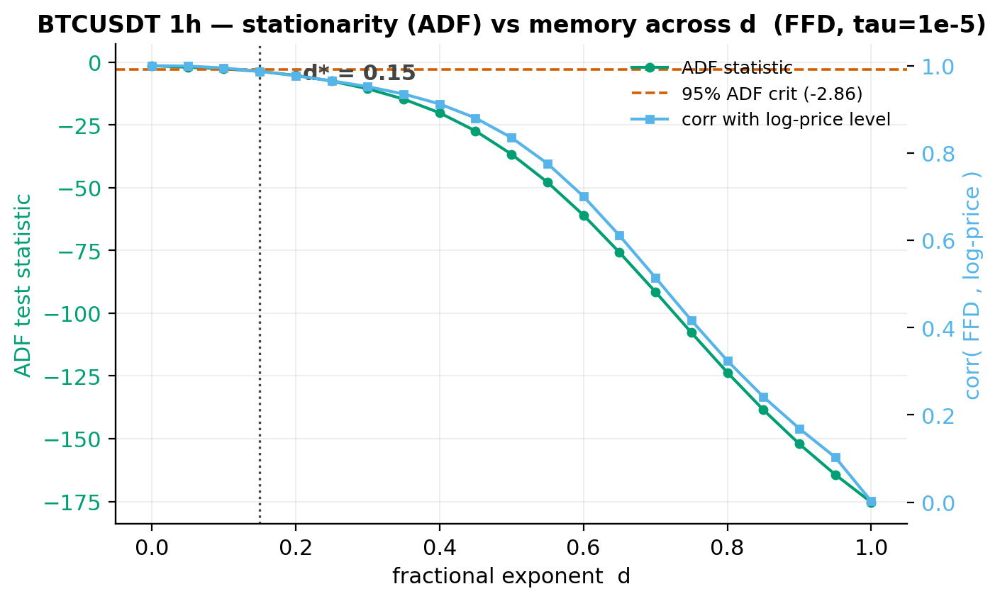
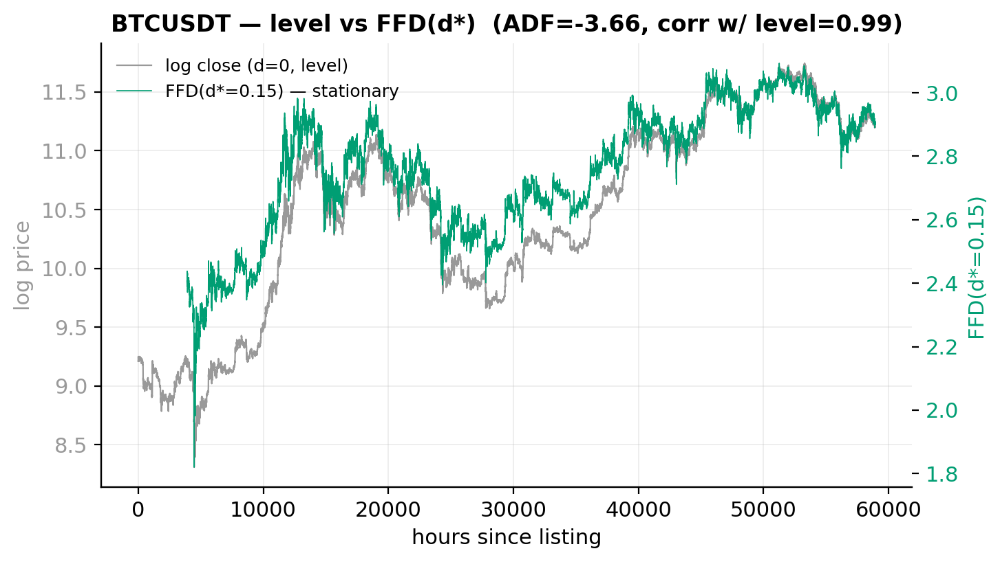
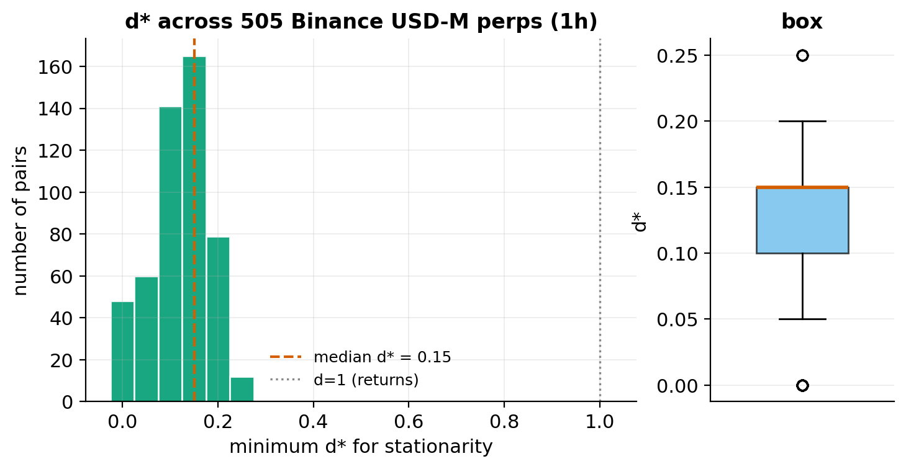
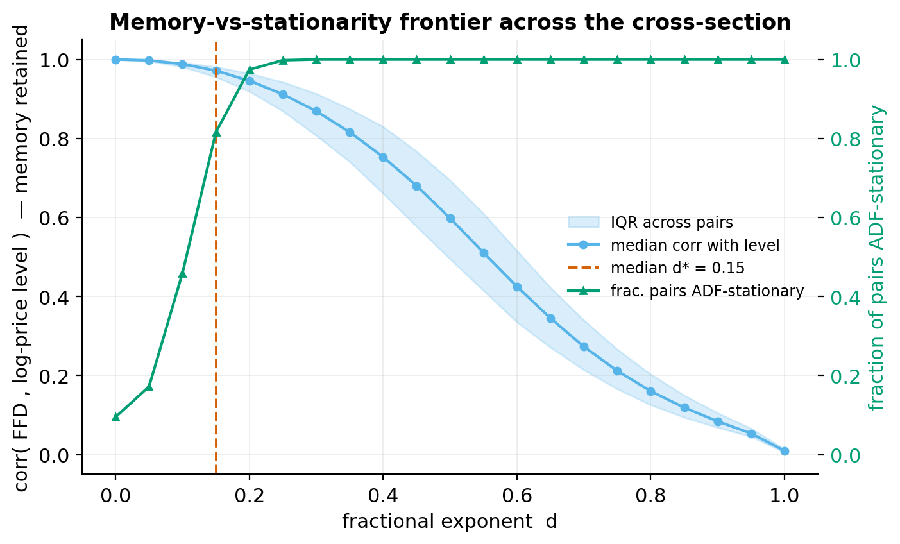
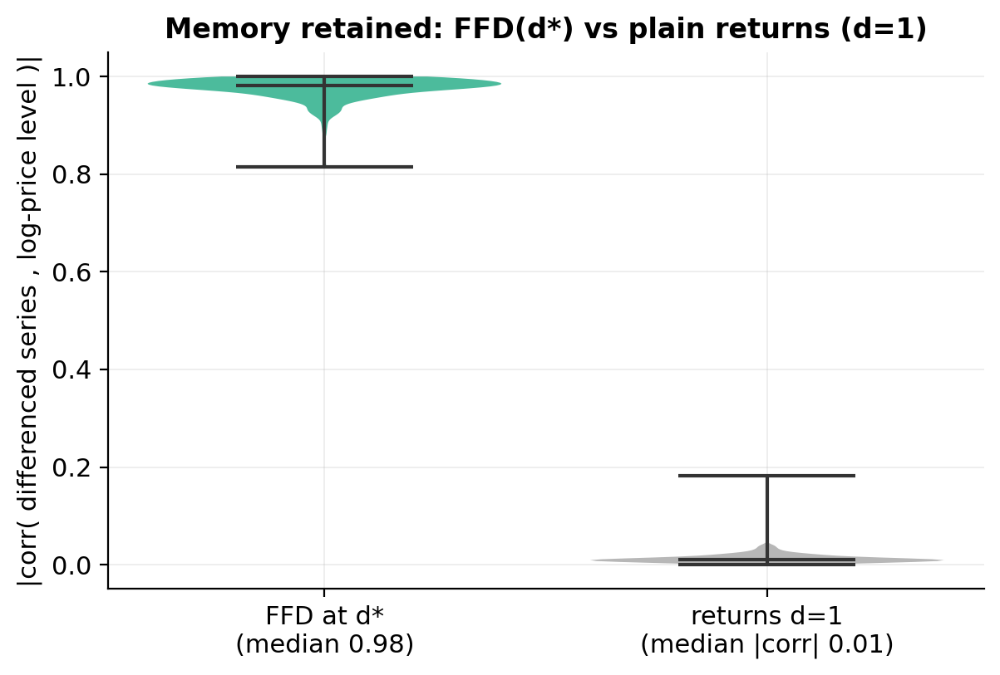
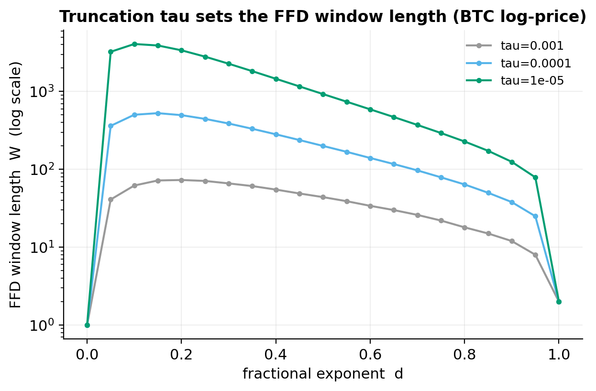
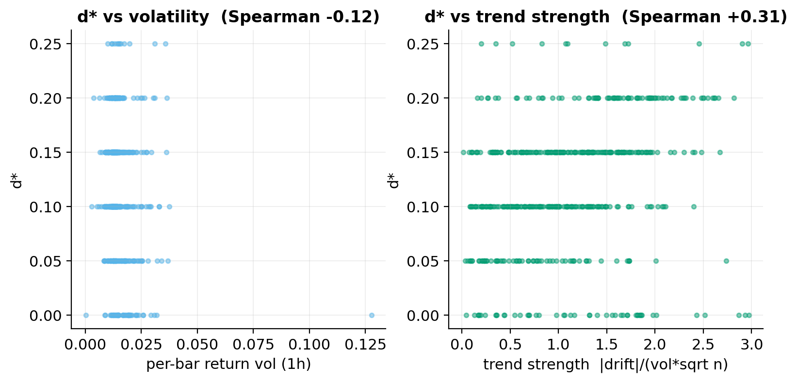
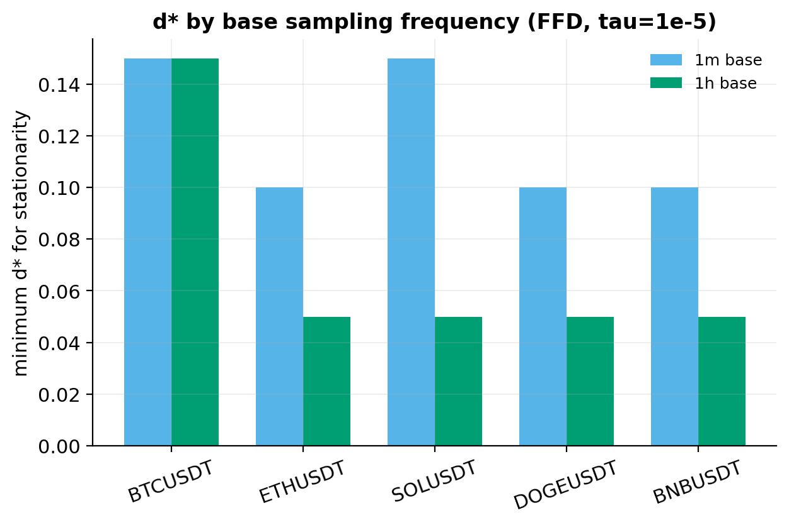

# Fractional Differentiation at Scale (López de Prado, AFML Ch. 5)

Reproduces and stress-tests López de Prado's Fixed-Width Window Fractional
Differentiation (FFD) on real crypto data, first on BTC (the textbook
reproduction), then across the full **568-pair Binance USD-M perpetual
cross-section** at 1-hour granularity, with a handful of original extensions.

All transforms are **causal** (output at bar *t* uses only bars ≤ *t*) and run
on **real OHLCV**, no synthetic series, no lookahead.

---

## 1. What LdP proposed

Standard practice differences a price series to integer order 1 (i.e. takes
returns) to make it stationary. This works, but it **erases the level**: a
return series is essentially uncorrelated with the price it came from, so all
the "memory" a predictive model could use is gone. Leaving the price
un-differenced (order 0) keeps the memory but is non-stationary (a unit root),
which breaks most statistical learning.

LdP's resolution is to difference to a **real, fractional** order *d* ∈ [0,1].
The operator (1−B)^d expands into an infinite weighted sum of lagged values with
binomial weights

```
w_0 = 1,   w_k = -w_{k-1} * (d - k + 1) / k.
```

For 0 < d < 1 these weights decay but never reach zero. **FFD** truncates the
weight vector at the first *k* with |w_k| < τ (we use τ = 1e-5), giving a
fixed-width, causal, backward-looking filter. Applied to log-prices it produces
a series that can be **stationary while preserving most of the memory**. The
key quantity is the **minimum d\***, the smallest *d* at which an ADF test
first rejects the unit root. LdP reports d\* typically well below 1 (often
~0.3-0.6 on equities/FX), with high correlation to the original level at d\*.

Implementation lives in [`lib/fracdiff.py`](../../../lib/fracdiff.py):
`ffd_weights`, `ffd` (a causal correlation via `np.convolve` on the reversed
kernel), and `min_d_search`. Sanity-checked: `ffd(x, d=1)` equals `np.diff(x)`
exactly, `ffd(x, d=0)` is the identity, and the vectorized output matches a
hand-rolled dot product.

## 2. Method & data

- **Data.** 568 Binance USD-M perp 1h parquets
  (`crypto_ohlcv_perp_all_1h/binance_um/*_1h.parquet`), `close` column only.
  Cleaned: drop non-positive / non-finite closes and any flat delisting tail;
  require ≥ 5,000 bars. **505 pairs** qualified. Transform applied to
  `x = log(close)`.
- **Grid.** d ∈ {0, 0.05, …, 1.00}, τ = 1e-5.
- **Stationarity.** `statsmodels` ADF, regression `"c"`, fixed `maxlag=1`,
  compared against the 95% critical value (≈ −2.86). d\* = smallest d whose ADF
  statistic falls below that critical value.
- **Memory.** Pearson correlation between the FFD series and the log-price
  level on the overlapping support.
- **Scale.** Cross-section parallelized over 32 cores; pairs streamed one at a
  time (never all 568 series in RAM at once).

Reproduce with:

```bash
python3 scripts/run_fracdiff_study.py     # BTC + 568-pair cross-section + figs/tables
python3 scripts/run_frequency_study.py    # 1m-vs-1h d* on 5 deep pairs
```

## 3. Reproduction result, BTC



For BTCUSDT 1h, the ADF statistic (green) crosses the 95% critical line at
**d\* = 0.15**, where the correlation with the log-price level (blue) is still
**0.987**. This is exactly LdP's Figure 5.x shape: a small fractional order
buys stationarity while almost all the memory survives. The overlay below makes
it concrete, the FFD(d\*) series is visibly stationary (mean-reverting around a
flat level) yet tracks the regime structure of the price:



## 4. At-scale result across 505 pairs



The minimum fractional order is **strikingly low and tight** across the whole
crypto cross-section:

| metric | value |
|---|---|
| pairs with valid d\* | 505 / 568 |
| **median d\*** | **0.15** (Q1 0.10, Q3 0.15, 95th pct 0.20) |
| max d\* observed | 0.25 |
| fraction with d\* < 1 | **100%** |
| **median memory at d\*** | **0.981** |
| median \|memory\| at d=1 (returns) | **0.010** |
| median FFD window at d\* | 3,901 bars |

The memory-vs-stationarity **frontier** ties it together: by d ≈ 0.20 essentially
every pair is ADF-stationary (green curve), while the median correlation with
the level (blue) is still ~0.9 and only collapses toward zero as d → 1.



**The headline.** Plain returns (d=1) destroy ~**99%** of the level memory that
FFD at d\* preserves (median \|corr\| 0.01 vs 0.98). That is the single chart
worth taking away:



Per-pair detail: [`tables/per_pair_fracdiff.csv`](../tables/per_pair_fracdiff.csv);
cross-sectional summary: [`tables/summary_fracdiff.md`](../tables/summary_fracdiff.md).

## 5. Notes, opinions & extensions

**(a) Memory destroyed by returns, quantified.** Confirmed and stark: median
correlation with level is **0.98 at d\*** vs **0.01 at d=1**. The LdP claim is
not marginal on crypto; it is overwhelming. If you are feeding a price-derived
feature into a model and you default to returns, you are throwing away nearly
all of the level information for the sake of a stationarity you could have had
at d ≈ 0.15.

**(b) τ (truncation) sensitivity.** On BTC, the threshold materially changes the
window length but only modestly shifts d\*:

| τ | d\* | window at d\* | corr w/ level |
|---|---|---|---|
| 1e-3 | 0.25 | 71 | 0.999 |
| 1e-4 | 0.20 | 497 | 0.997 |
| 1e-5 | 0.15 | 3,901 | 0.987 |



The compute/accuracy tradeoff is real: a looser τ truncates the long tail of
small weights, so the filter has a shorter memory and needs a *larger* d to
reach stationarity (0.25 vs 0.15). A τ of 1e-4 is a reasonable practical
compromise, two orders of magnitude smaller window (497 vs 3,901 bars) at
nearly identical memory (0.997). **Opinion:** for production features I'd
default to τ = 1e-4 unless the asset has very long memory; the 3,901-bar window
at τ = 1e-5 costs a lot of warm-up data (you lose the first ~160 days of an
hourly series) for a marginal d\* gain.

**(c) What predicts d\*?** d\* is essentially **uncorrelated with volatility**
(Spearman −0.12) but **positively correlated with trend strength**
(Spearman +0.31, where trend strength = |total drift| / (vol·√n)).



This makes sense: trendier (more persistent) series carry a stronger unit-root
component and need a touch more differencing to stationarize. It is a modest
effect, not a law, the d\* grid is coarse (0.05 steps) and most pairs cluster
at 0.10-0.15 regardless.

**(d) Frequency dependence (1m vs 1h).** For the five pairs with 1-minute
history (BTC/ETH/SOL/DOGE/BNB, ~1.58M bars each), d\* on the 1m base is *equal
or slightly higher* than on 1h (e.g. SOL 0.15 vs 0.05, ETH/DOGE/BNB 0.10 vs
0.05).



**Honest caveat:** this is partly a statistical-power artifact, not purely a
process property, with ~30× more observations the ADF test is far more powerful
and rejects the unit root at a *smaller* statistic, so the apparent ordering
should not be over-read. The robust takeaway is that d\* is **small at every
frequency tested**; it is not a knob that explodes when you sample finer.

**Surprising / negative findings (reported honestly):**
- **d\* is much lower on crypto than LdP's equity/FX numbers.** He cites
  ~0.3-0.6; we find a median of **0.15** and a max of only **0.25**. Crypto
  log-prices are *closer* to stationary than equity prices, likely because the
  series include violent mean-reverting alt-coin boom/bust cycles rather than a
  clean exponential drift.
- **48 pairs (≈10%) have d\* = 0.0**, their raw log-price already passes ADF.
  These are mostly alts that listed high and bled out, or range-bound names; for
  them fractional differentiation is unnecessary. Blindly differencing every
  series would *over*-difference these. d\* should be fit per-asset, not assumed.
- The d\* distribution is **tight** (Q1-Q3 = 0.10-0.15). In practice a single
  fixed d ≈ 0.15 would serve most of the crypto cross-section adequately, which
  weakens the case for an expensive per-asset search in a latency-sensitive
  pipeline.

**How this feeds a trading pipeline.** FFD(log close, d≈0.10-0.20) is a drop-in
**stationary-but-memory-preserving price feature**: it can go straight into a
classifier/regressor (or a stationarity-requiring model like a mean-reversion
band) without the unit-root pathologies of raw price and without the memory
amnesia of returns. The natural next step is to test whether models trained on
FFD features actually out-of-sample-beat the same models on returns, the
chapter asserts they should; we have not yet tested predictive lift here.

## 6. Limitations & reproducibility

- **ADF only.** Stationarity is judged by a single ADF spec (`"c"`, maxlag=1).
  A KPSS confirmatory test and an autolag-selected ADF would harden d\*; the
  fixed maxlag keeps the 568-pair sweep cheap and comparable across pairs.
- **Coarse d grid (0.05).** d\* is therefore quantized; the true crossing lies
  somewhere in the bracket below each reported d\*. A bisection refinement would
  sharpen the per-pair number but not move the medians.
- **Memory metric.** Correlation-with-level is LdP's own diagnostic and is
  intuitive, but it is a linear measure on a (now) stationary series vs a
  non-stationary one, read it as "how much of the level shape survives," not as
  a formal information measure.
- **Survivorship / delisting.** We trim flat delisting tails but do not model
  the survivorship of the listed universe; the cross-section is "pairs Binance
  currently lists with ≥5k hours of history."
- **Determinism.** No randomness anywhere; rerunning the two scripts reproduces
  every figure, CSV, and number byte-stably.

Rerun:
```bash
cd projects/02_fractional_differentiation
python3 scripts/run_fracdiff_study.py
python3 scripts/run_frequency_study.py
```

### Files

- `lib/fracdiff.py`, FFD weights, causal transform, min-d\* search (shared lib)
- `scripts/run_fracdiff_study.py`, BTC reproduction + 568-pair cross-section
- `scripts/run_frequency_study.py`, 1m-vs-1h d\* comparison
- `figures/fig1…fig8*.png`, eight publication figures (200 dpi)
- `tables/per_pair_fracdiff.csv`, `tables/summary_fracdiff.md`, plus
  `btc_adf_vs_d.csv`, `btc_tau_sensitivity.csv`, `dstar_vs_properties.csv`,
  `dstar_1m_vs_1h.csv`, `frontier_long.csv`

---

## Multi-market extension: crypto vs equities vs forex

The crypto cross-section above is one asset class. LdP's worked examples in
Ch. 5 are mostly equities/FX and land at **d\* ≈ 0.3-0.6**, noticeably higher
than the crypto median of 0.15 we measured. The obvious question is whether
that gap is a *market* effect (crypto prices carry more of a near-random-walk
level that needs little differencing) or just an artifact of the universe and
frequency. So we ran the **identical pipeline**, same d grid `[0,1]` step
0.05, same `tau=1e-5`, same `adfuller(maxlag=1, regression="c", autolag=None)`
at the 5% critical value, same memory metric (Pearson corr of the FFD series
with the log-price level), all causal, on two more markets, all at **1-hour**
granularity so the numbers are directly comparable:

- **US equities**, 9 Algoseek ETFs (SPY, QQQ, IWM, XLE, XLF, XLK, XLV, VXX,
  UVXY), 1-minute trade bars resampled to 1h (last trade price per hour),
  ~55k-78k hours each (2007→2025).
- **Forex**, 3 FXCM pairs at 1h (EURUSD resampled from 5-min, EURGBP, USDJPY),
  ~18k-88k hours each.

Crypto results are **loaded** from `tables/per_pair_fracdiff.csv` (not
recomputed). Script: `scripts/run_fracdiff_multimarket.py`.

### By-market result

| market   |   n | median d\* | IQR (Q1-Q3)   | % d\*<1 | median corr @ d\* | median \|corr\| @ d=1 |
|----------|----:|-----------:|---------------|--------:|------------------:|----------------------:|
| crypto   | 505 |      0.150  | 0.100-0.150   |    100% |             0.981 |                 0.010 |
| equities |   9 |      0.150  | 0.000-0.150   |    100% |             0.997 |                 0.007 |
| forex    |   3 |      0.100  | 0.050-0.125   |    100% |             0.994 |                 0.010 |

Figures: `fig9_dstar_by_market.png` (d\* distribution per market with LdP's
0.3-0.6 band shaded) and `fig10_memory_by_market.png` (memory kept at d\* vs
erased at d=1, all three markets).

### Does LdP's 0.3-0.6 hold for equities/FX here? No.

At 1h, **neither equities nor forex shows a higher d\* than crypto**, if
anything they are equal or lower. Equities median d\* is **0.15** (identical to
crypto); forex is **0.10** (lower). Every instrument in all three markets is
stationary at some d\* < 1 (100% across the board), and most need only a small
fractional touch. Several instruments are already ADF-stationary at the **raw
log level** (d\* = 0): the two volatility ETFs **VXX and UVXY** (structurally
mean-reverting / decaying products), the energy sector **XLE**, and the
range-bound **EURGBP** cross. The highest single reading in the whole extension
is **QQQ at 0.25**, still well below LdP's lower bound of 0.3.

In other words, **LdP's ~0.3-0.6 figure does not reproduce for these
equity/FX series at 1h** with this exact (and shared) methodology. It is
refuted, not confirmed, by the actual numbers.

The memory story, by contrast, **is** universal: in every market FFD at d\*
retains ~0.98-1.00 correlation with the log-price level while plain returns
(d=1) retain ~0.01 in absolute value. The central LdP claim, *fractional
differencing buys stationarity for almost no loss of memory, where integer
differencing throws the memory away*, holds identically across crypto,
equities and forex (see `fig10`).

### Caveats (read these before over-reading the gap)

- **Frequency is the prime suspect.** We compare all three markets at 1h, but
  LdP's 0.3-0.6 examples are not all 1h (his dollar-bar / daily examples differ).
  Our own crypto frequency study (`run_frequency_study.py`, fig8) already shows
  d\* shifts with sampling frequency, so a 1h-vs-LdP comparison conflates market
  with bar size. The honest read is "at 1h, all three markets sit near 0.1-0.25,"
  not "equities have permanently low d\*."
- **ADF power.** d\* is the *smallest grid point that passes ADF*, and ADF power
  grows with sample length. The equity/FX series here are long (often 55k-88k
  bars), which biases d\* **down**, a longer series passes ADF at a smaller d.
  Part of the low equity/FX d\* is sample-length, not market structure.
- **Forex is a thin sample.** Only 3 clean pairs (and EURUSD covers ~3 years);
  the forex median rests on three numbers and should not be read as a market-wide
  estimate. We deliberately did not pad it with synthetic or low-quality pairs.
- **Equities are ETFs, not single names.** Index/sector ETFs are smoother and
  more mean-reverting than individual stocks; single-stock d\* could be higher.
  This is a basket result, not a single-stock result.
- **Grid resolution.** The 0.05 grid floors small d\* values; a finer grid near
  zero might separate the d\*=0 and d\*=0.05 cases but would not move the medians.

### Opinion

Taken at face value the data **refutes** the idea that equities/FX inherently
need more differencing than crypto, at a matched 1h frequency they need the
same or less. But I would not bank on that as a market-structure law: the
equity/FX series are much longer than the median crypto perp, and ADF's
length-driven power plus the frequency mismatch with LdP's examples are large
enough to explain the whole "gap" on their own. My read is that **d\* is
governed more by sampling frequency and series length than by asset class**,
and that the durable, cross-market finding here is the *memory* result, not the
*level* of d\*: FFD at a small fractional d delivers stationarity while keeping
~0.98 correlation with the price level in crypto, equities and forex alike,
whereas returns keep essentially none. That robustness, identical across three
very different markets, is the part of LdP Ch. 5 that clearly survives contact
with real data.

### Multi-market files

- `scripts/run_fracdiff_multimarket.py`, equities + forex at 1h, loads crypto
  results, builds the combined table and figures (standalone, idempotent)
- `tables/multimarket_fracdiff_per_instrument.csv`, market, instrument, d\*,
  ADF stat/p, corr @ d\*, corr @ d=1 (all markets)
- `tables/multimarket_fracdiff_summary.md`, by-market medians/IQR/%d\*<1/memory
- `figures/fig9_dstar_by_market.png`, `figures/fig10_memory_by_market.png`
